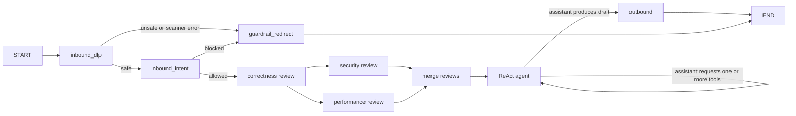
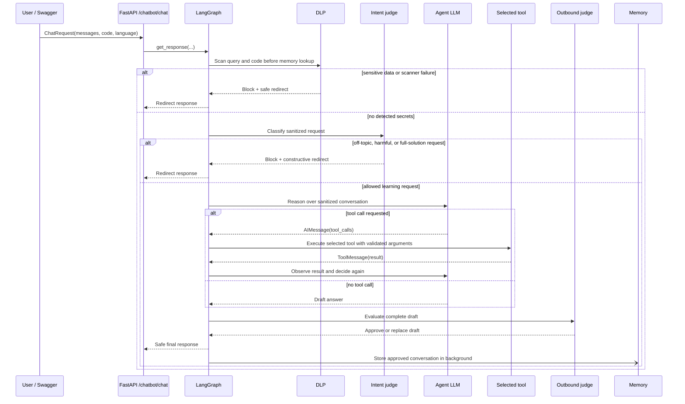

# Integrated Agentic Architecture

This document describes the production request path implemented by
`app/core/langgraph/graph.py`. The system is an agentic ReAct-style workflow:
the model decides whether it needs a tool, observes the tool result, and may
continue reasoning until it can produce a final answer. The graph supplies
bounded execution and safety boundaries; it does not force a fixed sequence of
specialist agents for every request.

## High-level graph



There is one agent node, but it has two kinds of turns:

1. A model turn calls the bound LLM with the conversation and sanitized context.
2. A tool turn executes the tool calls from the most recent assistant message.

The model turn and tool turn both enter `agent`, creating a checkpoint boundary
between them. This is important for `ask_human`: if that tool interrupts, the
checkpoint contains the assistant tool request, so the graph can resume the
pending tool call instead of asking the model to make the same decision again.

## Request lifecycle



## How the agent chooses a tool

`LangGraphAgent` keeps the agent tool registry locally and binds those tools
to the current model when the agent is invoked. The shared `llm_service`
supplies models but does not bind the agent's tools:

- `duckduckgo_search_tool`: use when current or external information is needed.
- `ask_human`: use when the agent needs clarification or a decision from the user.

Before the ReAct agent runs, the graph executes correctness, security, and
performance review nodes in parallel and merges their findings into ordered
`review_findings`. The aggregate `review_code` helper remains available for
direct tooling/tests but is not a tool bound to the main agent.

The model receives the tool schemas, names, descriptions, and argument types
through the provider's tool-binding interface. It chooses a tool by returning an
`AIMessage` with a `tool_calls` collection. The graph does not parse natural
language to guess the tool. It uses the structured call produced by the model:

For code diagnosis and review requests, the graph has already run the
correctness, security, and performance lanes before the model turn. The agent
receives those merged findings and can still select an optional tool when it
needs external information or human clarification.

The merged review findings are ordered by category and severity so correctness
blockers, security, performance, and style observations appear in priority
order. Syntax findings are preserved by the response helper when the model
summary omits them.

```python
AIMessage(
    content="",
    tool_calls=[
        {
            "name": "duckduckgo_search",
            "args": {"query": "Python handling of empty averages"},
            "id": "call_123",
            "type": "tool_call",
        }
    ],
)
```

`_agent` looks up the requested name in `self.tools_by_name`. Unknown names fail
closed. Known tools are invoked with `tool.ainvoke(args)` and their results are
appended as `ToolMessage` objects. If the model returns several independent
calls, they run concurrently with `asyncio.gather`. The next agent turn sees
those tool results and decides whether to call another tool or answer directly.

The loop is bounded by `AGENT_MAX_STEPS`. The runtime recursion limit is:

```text
2 * AGENT_MAX_STEPS + 4
```

The extra four graph steps account for inbound DLP, inbound intent, the initial
agent step, and outbound validation. This prevents a malformed model response
from creating an unbounded loop.

## State carried through the graph

`GraphState` is a `TypedDict` in `app/schemas/graph.py`. The important fields are:

| Field | Producer | Purpose |
|---|---|---|
| `messages` | request and agent | Conversation and tool messages persisted by the checkpointer |
| `user_query` | graph input | Latest user request used by guardrails and context-aware nodes |
| `code`, `language` | graph input | Optional submitted code and its language |
| `sanitized_query`, `sanitized_code` | inbound DLP | Redacted content permitted beyond the inbound perimeter |
| `is_safe_sensitive` | inbound DLP | Whether the DLP scan passed |
| `is_safe_intent` | inbound intent | Whether the request is in scope and educationally safe |
| `inbound_trigger_reason` | inbound guardrails | Why the request was blocked, if applicable |
| `draft_response` | agent | Complete assistant draft before delivery validation |
| `is_safe_output` | outbound judge | Whether the draft passed delivery validation |
| `final_response` | outbound or redirect | The only response intended for the user |

## Guardrail behavior

### Inbound DLP

`inbound_dlp_node` scans the query and submitted code for API keys, tokens,
password assignments, private keys, credit-card numbers, JWTs, and other
high-entropy credential-like values. The generic entropy fallback requires a
longer opaque value and explicit nearby credential context, which avoids treating
ordinary source identifiers or example application code as secrets. If it detects
a secret, it records the category and returns a non-technical redirect. The
agent does not continue to the intent judge or the main model for that turn.

When the scanner succeeds without finding a secret, the sanitized query and
code are stored in state. `_agent` replaces the latest human message with the
sanitized query and uses sanitized code in the system context, so the main agent
does not receive the original detected secret.

If the request is blocked, `guardrail_redirect` also replaces the latest human
message in the checkpoint with its sanitized form before appending the redirect.
This prevents a detected secret from remaining in chat history or being added
to long-term memory through the blocked response path.

The response entry points also run this scan before memory search. Safe memory
search uses only `sanitized_query`; a request that contains detected sensitive
data does not perform a memory search. The graph repeats DLP as its authoritative
state transition, which keeps direct graph invocations and API invocations on
the same guarded path.

### Inbound intent

`inbound_intent_node` evaluates only the sanitized request. It allows legitimate
debugging, explanation, testing, and code-review requests. It blocks harmful or
illegal requests, off-topic requests, prompt-injection attempts, and demands
for a complete ready-to-submit solution. A judge failure fails closed and
returns a safe rephrasing request.

### Outbound validation

The agent never finishes directly at `END`. A final model response is stored as
`draft_response` and routed to `outbound_node`. The outbound judge checks the
complete draft for full-solution leaks and harmful content. If it blocks the
draft, the graph replaces the assistant message in the checkpoint with the
constructive redirect. This prevents blocked text from remaining in history or
being added to long-term memory.

Streaming uses the same safe boundary: `get_stream_response` invokes the graph
to completion, waits for outbound validation, and only then re-chunks the
approved `final_response` into SSE-compatible pieces. An unsafe draft is never
streamed before it is evaluated.

## Complete example: debugging a user submission

### 1. Swagger request

After authenticating and creating a session, open `/docs` and call
`POST /api/v1/chatbot/chat` with the session bearer token:

```json
{
  "messages": [
    {
      "role": "user",
      "content": "Why does this Python function fail when I pass an empty list? Please help me reason about the fix."
    }
  ],
  "code": "def average(numbers):\n    return sum(numbers) / len(numbers)\n\nprint(average([]))",
  "language": "python"
}
```

### 2. Initial state

`_build_graph_input` creates state similar to:

```python
{
    "messages": [{"role": "user", "content": "Why does ... empty list?"}],
    "user_query": "Why does ... empty list?",
    "code": "def average(numbers): ...",
    "language": "python",
    "long_term_memory": "...",
    "skill_profile": "...",
    "problem_id": "<sha256 prefix of submitted code>",
}
```

### 3. Inbound DLP

No credentials are present, so DLP writes:

```python
{
    "is_safe_sensitive": True,
    "sanitized_query": "Why does this Python function fail when I pass an empty list? Please help me reason about the fix.",
    "sanitized_code": "def average(numbers):\n    return sum(numbers) / len(numbers)\n\nprint(average([]))",
}
```

The graph proceeds to `inbound_intent`.

### 4. Inbound intent

The intent judge sees a debugging request, not a demand for a complete
submission. It returns `is_safe_intent=True`, so the graph enters `agent`.

### 5. Agent decision

The model can answer from the supplied context, so it may return a final
`AIMessage` directly:

```text
The failure comes from dividing by len(numbers) when the list is empty. What
condition could you check before performing the division, and what behavior do
you want for an empty input?
```

If the model needs a tool instead, it might return a structured `review_code`
call. The graph executes that call, appends the result, and invokes the model
again so it can incorporate the observation. The model—not a hard-coded graph
branch—decides whether another tool call is useful.

### 6. Outbound validation and response

The complete draft is sent to `outbound_node`. Because the example response
provides a diagnosis and a guiding question rather than a complete replacement
implementation, the judge approves it. The API returns the assistant message.

If the model had returned a complete ready-to-paste implementation, outbound
validation would replace it with a constructive hint before the response was
returned or stored.

## Testing through Swagger

The application exposes the OpenAPI UI at `/docs` and the OpenAPI JSON at
`/openapi.json` (the exact host and API prefix come from the environment). The
chat router is mounted under `/api/v1/chatbot` by default.

Useful manual cases:

1. **Normal debugging:** use the example above. Expect a normal assistant reply.
2. **Inbound DLP:** submit `api_key = "sk-abcdefghijklmnopqrstuvwx"` in `code`. Expect a credential-removal redirect and no agent answer.
3. **Inbound intent block:** ask for a complete ready-to-submit assignment solution. Expect a learning-oriented redirect.
4. **Tool use:** ask for current documentation or a focused code review. Inspect logs or Langfuse to see the selected tool call and subsequent observation turn.
5. **Outbound block:** use a test model/mock that returns a complete solution. Expect the constructive outbound redirect, never the full draft.
6. **Streaming:** call `POST /api/v1/chatbot/chat/stream`. The approved answer arrives as SSE chunks only after outbound validation.

The authenticated endpoints require the bearer token issued by the auth routes.
Use the lock icon in Swagger to authorize the session before calling the chat
routes.

## Persistence and observability

- `AsyncPostgresSaver` persists graph state by `thread_id`/session ID.
- `aget_state` detects an interrupted `ask_human` turn before a new request.
- Memory search and skill-profile retrieval run concurrently before a new turn.
- Approved conversation state is added to long-term memory in a background task.
- Agent LLM calls use the configured retry/fallback service and Prometheus timing.
- Langfuse callbacks are attached to graph invocations when tracing is enabled.
- Structured logs record graph, guardrail, tool, and failure events without putting
  user secrets into log messages.
