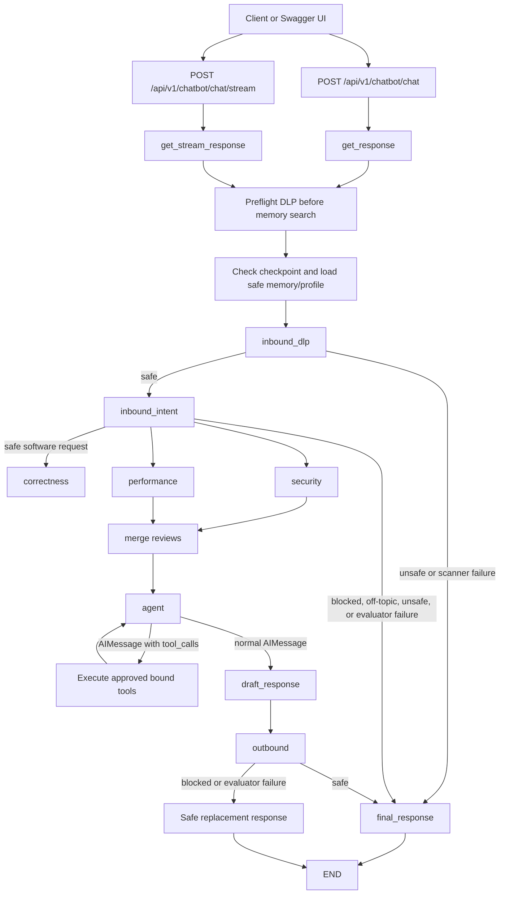

# Current Agentic Architecture Reference

This document is the implementation reference for the current FastAPI and LangGraph workflow in `app/core/langgraph/graph.py`. It explains what happens to a request from API intake through inbound safety checks, the agent's self-looping tool workflow, and outbound approval.

The code is the source of truth. This document explains the code as it exists now: safe requests enter three parallel review lanes, their findings are merged, and a ReAct-style agent uses those findings before selecting optional tools.

## 1. High-level flow



The graph has three conceptual perimeters:

1. **Inbound perimeter:** DLP redaction followed by intent classification.
2. **Review fan-out:** correctness, security, and performance nodes run in parallel and are merged by priority.
3. **Agent core:** one ReAct node alternates between model reasoning and optional tool execution.
4. **Outbound perimeter:** a structured safety decision before a response is returned or streamed.

The graph itself is built with `StateGraph`, conditional edges, and `Command` transitions. These are standard LangGraph patterns: nodes read and update shared state, conditional edges choose the next node, and `Command` can update state and route in one operation. See the official [LangGraph Graph API](https://docs.langchain.com/oss/python/langgraph/graph-api).

## 2. Source map

| Responsibility | Current source |
|---|---|
| Graph construction, orchestration, persistence, response entry points | `app/core/langgraph/graph.py` |
| Secret detection, redaction, and DLP fail-closed behavior | `app/core/langgraph/nodes/inbound_first_stage.py` |
| Safe/unsafe intent classification | `app/core/langgraph/nodes/inbound_intent.py` |
| Final response safety classification | `app/core/langgraph/nodes/outbound.py` |
| Tool registry | `app/core/langgraph/tools/__init__.py` |
| Parallel correctness/security/performance review lanes | `app/core/langgraph/nodes/` |
| Human interrupt tool | `app/core/langgraph/tools/ask_human.py` |
| Web-search tool | `app/core/langgraph/tools/duckduckgo_search.py` |
| Shared graph state | `app/schemas/graph.py` |
| API request/response validation | `app/schemas/chat.py` |
| Chat routes used by Swagger | `app/api/v1/chatbot.py` |
| System instructions that guide model tool use | `app/core/prompts/system.md` |
| Guardrail instructions | `app/prompts/guardrails.py` |

## 3. API intake and Swagger

The FastAPI router exposes:

- `POST /api/v1/chatbot/chat` for a complete JSON response.
- `POST /api/v1/chatbot/chat/stream` for Server-Sent Events (SSE).
- `GET /api/v1/chatbot/messages` for the session history.
- `DELETE /api/v1/chatbot/messages` to clear the session history.

The exact `api/v1` prefix comes from `settings.API_V1_STR`; confirm it in the running application's OpenAPI document if the deployment uses a different prefix.

FastAPI generates interactive Swagger UI at `/docs` and the OpenAPI schema at `/openapi.json`. The request body is generated from the Pydantic `ChatRequest` model, so Swagger exposes `messages`, optional `code`, and optional `language` with their validation rules. See [FastAPI's first steps](https://fastapi.tiangolo.com/tutorial/first-steps/), [FastAPI request bodies](https://fastapi.tiangolo.com/tutorial/body/), and [FastAPI metadata and docs URLs](https://fastapi.tiangolo.com/tutorial/metadata/).

The request normally passes through the authenticated session dependency. When testing from Swagger, use the **Authorize** button if the deployment requires a bearer token; FastAPI documents this flow in [Security - First Steps](https://fastapi.tiangolo.com/tutorial/security/first-steps/).

Example body:

```json
{
  "messages": [
    {
      "role": "user",
      "content": "Review this Python code and identify the exact root problems. Do not provide replacement code."
    }
  ],
  "language": "python",
  "code": "def divide(a, b):\n    return a / b\n"
}
```

Before LangGraph runs, Pydantic validates that:

- at least one message exists;
- each message has a permitted role and non-empty content;
- message content is within the configured length and does not contain null bytes or script tags;
- code, when present, does not contain null bytes and is within its maximum length.

These are API validation checks, not substitutes for the graph's DLP and intent guardrails.

## 4. What `get_response` and `get_stream_response` do

Both response entry points in `graph.py` perform the same safety-critical preparation:

1. Obtain the lazily compiled graph.
2. Create a `RunnableConfig` containing the session `thread_id`, tracing callbacks, user/session metadata, and a recursion limit.
3. Run a DLP preflight on the latest user message and optional code before searching long-term memory.
4. Search memory only when the preflight produces a safe query; also load the user's skill profile.
5. Check whether this `thread_id` has a paused graph, for example because `ask_human` requested input.
6. Resume the checkpoint with `Command(resume=...)`, or build a fresh graph input.
7. Invoke the compiled graph.
8. Persist useful conversation state to memory after the completed response.

The initial state includes the messages, raw code and language, sanitized query/code fields populated by the graph, memory, skill profile, latest user query, and a short `problem_id` hash when code is supplied. The hash is an identifier for correlation; it is not a secret and is not used as an authentication credential.

The production graph uses `AsyncPostgresSaver` when the PostgreSQL pool is available. LangGraph checkpointers save state at graph steps and associate it with a thread, which enables resume and durable workflow state. See the official [LangGraph persistence documentation](https://docs.langchain.com/oss/python/langgraph/persistence).

## 5. Inbound guardrail layer 1: DLP and sanitization

### Input to the DLP node

`inbound_dlp_node` receives the latest user query, optional code, and the problem identifier. It scans both the query and code.

### Detection behavior

The scanner recognizes known credential forms such as private keys, cloud access keys, provider tokens, JWT-like values, credential assignments, valid credit-card-like numbers, and high-entropy opaque values when they occur near credential words such as `password`, `token`, `authorization`, `secret`, or `api_key`.

Some opaque values are deliberately treated as benign, including UUIDs, Git commit hashes, ordinary Python identifiers, and data URIs. This reduces false positives while preserving the fail-safe behavior for likely credentials.

### Safe result

When no sensitive value is detected, the node returns:

```text
is_safe_sensitive = true
detected_secret_types = []
sanitized_query = original query
sanitized_code = original code or null
```

The graph then routes to `inbound_intent`.

### Sensitive or scanner-failure result

When a secret is detected, the scanner redacts the matched value and returns `is_safe_sensitive = false`. When the scanner itself raises an exception, it also fails closed with `DLP_SCANNER_ERROR` and replacement content.

The graph routes both cases to `guardrail_redirect`, not to the agent. The redirect asks the user to remove credentials and try again. The redacted content is used when updating the conversation so the unsafe original is not passed onward as agent input.

## 6. Inbound guardrail layer 2: intent classification

Only DLP-safe content reaches `inbound_intent_node`. The node constructs a structured judge request containing the sanitized query and sanitized code, then asks the primary LLM service for an `InboundIntentJudgeOutput`.

The judge distinguishes useful software-engineering requests from requests that should not enter the coding agent, including off-topic, harmful/illegal, solution-extraction, or evaluator-failure cases. The guardrail prompt has a specific exception for a request that says “give me the full fix” but also clearly asks for only the exact root cause and forbids replacement code: that is treated as a diagnosis request rather than automatically as a solution-extraction request.

If the primary judge fails, the node tries the fallback client. If both fail, it returns `EVALUATOR_ERROR` and blocks the turn. This is fail-closed behavior.

The graph routing function is intentionally simple:

```text
is_safe_intent == true  -> agent
is_safe_intent == false -> guardrail_redirect
```

The redirect is deterministic for known reasons, or uses the constructive redirect returned by the classifier when available.

## 7. The agent node and the self-loop

After both inbound stages pass, `graph.py` fans out into correctness, security, and performance review nodes. Their `findings` updates are merged by LangGraph's reducer and ordered in `merge_reviews`. The graph then enters the ReAct agent node. This is an agentic loop because the model can choose an optional tool, observe the result, and reason again instead of following a fixed one-shot chain.

The loop has two modes:

### Mode A: execute pending tool calls

If the most recent message is an `AIMessage` containing `tool_calls`, the graph:

1. Reads each requested tool name and arguments.
2. Looks up the name in `self.tools_by_name`, which was built from the explicit registry.
3. Rejects an unknown name instead of executing arbitrary functions.
4. Executes registered optional tools; review language is already available to the parallel review lanes.
5. Invokes one tool or executes multiple independent tool calls concurrently with `asyncio.gather`.
6. Converts every result into a `ToolMessage` associated with the original `tool_call_id`.
7. Routes back to `agent`.

The tool result is therefore checkpointed before the next model decision. This is particularly important for `ask_human`, because its interrupt must be resumable.

### Mode B: ask the model for the next decision

If there is no pending tool call, the node:

1. Builds the system prompt with sanitized code context, memory, username, and skill profile.
2. Replaces the latest human message with `sanitized_query`, so DLP-approved content—not the original raw content—reaches the model.
3. Calls the configured LLM service.
4. If the response contains tool calls, checkpoints that `AIMessage` and loops to `agent`.
5. Otherwise stores the text as `draft_response` and routes to `outbound`.

The graph declares the agent destinations as `agent` and `outbound`, and gives this node a retry policy with three attempts. The invocation config also sets a bounded recursion limit based on `AGENT_MAX_STEPS`, preventing an endlessly tool-happy model from running forever. LangGraph documents recursion-limit failures and the need to bound recursive graph behavior in [GRAPH_RECURSION_LIMIT](https://docs.langchain.com/oss/python/langgraph/errors/GRAPH_RECURSION_LIMIT).

## 8. How the ReAct agent chooses a tool

The application does not use a separate Python `if/elif` classifier to choose between the tools. The process is:

```text
explicit Python agent registry
        -> LangGraphAgent binds tools to its local model
        -> model receives tool schemas and descriptions
        -> model returns AIMessage.tool_calls when a tool is useful
        -> graph validates the name against tools_by_name
        -> graph executes the selected tool
        -> ToolMessage is returned to the model
        -> model decides whether to answer or call another tool
```

The current registry is:

| Tool | Intended use | Typical model decision |
|---|---|---|
| `duckduckgo_search` | Retrieve external information when current or external facts are needed | Use when the answer needs web research rather than only the supplied code/context |
| `ask_human` | Pause the graph and request clarification or a human decision | Use when the next step cannot be selected safely without user input |

This is standard tool-calling behavior: the agent binds tools to its local model, the model emits structured tool calls, the application executes them, and the tool result is sent back with a matching call ID. See [LangChain tool calling](https://docs.langchain.com/oss/python/langchain/models#tool-calling).

The system prompt is the policy layer that tells the model when a tool is appropriate. The Python registry is the enforcement layer that limits execution to known tools. Both are required: the prompt guides selection, while the registry prevents an arbitrary tool name from being executed.

### Current review behavior

For a safe request, the graph now runs correctness, security, and performance review nodes concurrently before the agent's first model turn. `merge_reviews` orders their findings so correctness blockers appear before security, performance, and style observations. The aggregate `review_code` tool remains available as a standalone capability for direct tooling/tests, but it is not bound to the main agent because the graph already performs the three review lanes.

## 9. Outbound guardrail

The agent's text is first stored as `draft_response`; it is not delivered immediately. The `outbound` node submits the sanitized user context and the complete draft to a structured outbound judge.

1. Primary outbound judge evaluates the draft.
2. On primary failure, the fallback judge is tried.
3. If both fail, the node returns `SAFE_TIMEOUT_RESPONSE` and marks the output unsafe.
4. If the output is safe, `final_response` is the draft.
5. If the output is unsafe, `final_response` is the judge's constructive redirect.
6. When blocked, `_outbound` replaces the last assistant message with the safe response before the state is checkpointed and returned.

The important guarantee is that the blocked draft is not merely labeled unsafe while remaining in the final message list. The message itself is replaced.

## 10. Streaming behavior

The streaming endpoint uses SSE at the FastAPI layer, but `get_stream_response` first invokes the graph to completion. It waits until outbound approval has happened, then splits the approved `final_response` into 256-character chunks.

This ordering is deliberate: emitting model tokens before outbound approval could leak text that the outbound guardrail later rejects. The client receives chunks only after the complete response has passed or been replaced by the outbound safety result. LangGraph's general streaming model is documented in [LangGraph streaming](https://docs.langchain.com/oss/python/langgraph/streaming); this application adds the approval-before-chunking policy for safety.

## 11. Persistence, interrupts, and resume

The graph is compiled with `AsyncPostgresSaver` when the database pool is available. The API uses the session ID as `thread_id`, so the same conversation can be inspected and resumed.

If `ask_human` interrupts the graph:

1. The checkpoint records the paused state and next node.
2. The API returns the interrupt question.
3. A later request with the same session/thread resumes the graph using `Command(resume=...)`.
4. The agent continues from the checkpoint and may then answer or select another tool.

LangGraph's [interrupt documentation](https://docs.langchain.com/oss/python/langgraph/interrupts) explains why a checkpointer and stable thread ID are required for this pattern.

## 12. Complete example: request through the full pipeline

Assume Swagger submits this sanitized request:

```json
{
  "messages": [
    {
      "role": "user",
      "content": "Identify the exact root problems only. Do not provide replacement code."
    }
  ],
  "language": "python",
  "code": "def average(values):\n    return sum(values) / len(values)\n"
}
```

The runtime sequence is:

1. **FastAPI intake:** `ChatRequest` validates the body. The authenticated session supplies the session ID used for the graph thread.
2. **Memory preflight:** `graph.py` sends the latest user text and code to DLP before memory search. No credential is detected, so a safe query may be used for memory retrieval.
3. **Graph initialization:** `_build_graph_input` stores the messages, code, language, memory, profile, query, and problem hash.
4. **DLP node:** The query and code are scanned again inside the graph. They are safe, so `is_safe_sensitive` is true and the sanitized fields contain the original values.
5. **Intent node:** The structured judge sees a software-engineering diagnosis request. It returns `is_safe_intent = true`, so the graph fans out into the three review lanes.
6. **Parallel review and merge:** Correctness, security, and performance run concurrently. `merge_reviews` orders the combined findings and stores them in `review_findings`.
7. **Model decision:** The ReAct agent receives the merged findings and may select an optional tool when external information or human clarification is needed. A search tool call may look like:

   ```json
   {
     "tool_calls": [
       {
         "name": "duckduckgo_search",
         "args": {
            "query": "Python handling of empty averages"
         }
       }
     ]
   }
   ```

8. **Tool execution:** The graph validates the requested tool against the agent-owned registry, invokes it, appends a correlated `ToolMessage`, and loops to `agent`.
9. **Model synthesis:** The model sees the tool result and writes a diagnosis-only answer. If the parallel lanes identified syntax blockers, the helper preserves them in the final text even if the model summary forgot to mention syntax.
10. **Outbound review:** The complete diagnosis is sent to the outbound structured judge. If approved, it becomes `final_response`; if blocked, the draft is replaced with a safe constructive response.
11. **Delivery:** `/chat` returns the final assistant message. `/chat/stream` emits the approved final response in chunks only after step 10.

If the exact same request contained a real credential, step 2 and step 4 would stop the request before the intent judge and agent. If the intent judge classified it as solution extraction, step 5 would route to `guardrail_redirect`. If the outbound judge rejected the final answer, the client would receive the replacement response rather than the rejected draft.

## 13. Decision table for testing

| Scenario | Expected path | Expected observable result |
|---|---|---|
| Normal debugging question without code | DLP -> intent -> agent -> outbound | Helpful answer after outbound approval |
| Safe code diagnosis request | DLP -> intent -> three review lanes -> merge -> agent -> outbound | Merged findings are summarized; diagnosis-only instruction is respected |
| Credential in query or code | DLP -> redirect -> END | Credential warning; no agent call |
| DLP exception | DLP fail closed -> redirect -> END | Safe scanner-error response |
| Off-topic request | DLP -> intent block -> redirect -> END | Focused software-engineering redirect |
| Full-solution extraction request | DLP -> intent block -> redirect -> END | Guidance/learning redirect, no ready-to-submit solution |
| Primary intent judge failure | DLP -> fallback intent judge | Fallback result determines routing |
| Both intent judges fail | DLP -> evaluator-error redirect | No agent execution |
| Model selects unknown tool | Agent tool lookup fails | Request fails safely; arbitrary function is not executed |
| Model selects `ask_human` | Agent -> interrupt/checkpoint | User receives a question; same session resumes it |
| Outbound judge rejects draft | Agent -> outbound -> safe replacement | Rejected draft is replaced before response delivery |
| Streaming response | Full graph -> outbound -> chunk approved final response | No rejected draft is streamed |

## 14. What this architecture guarantees, and what it does not

### Guarantees provided by the current implementation

- Raw input is checked for sensitive data before memory search and again at graph entry.
- DLP and intent failures fail closed into a redirect path.
- Only registered tools can be executed.
- Tool results are returned to the model through correlated `ToolMessage` objects.
- The agent can self-loop across multiple tool rounds within a bounded recursion limit.
- Human-tool interruptions can be checkpointed and resumed.
- Outbound validation happens before normal or streamed delivery.
- A blocked outbound draft is replaced, not merely annotated.

### Current limitations to keep in mind

- The three review lanes run for safe requests before the ReAct agent; the aggregate `review_code` tool is not bound to the main agent.
- Tool selection depends on model behavior plus the system prompt; the graph validates execution but does not independently infer the user's intent.
- The outbound judge is another LLM-based classifier, so its structured-output behavior should be covered with FastAPI integration tests and fallback tests.
- Runtime integration tests require the project's configured dependencies and services; static compilation alone does not prove database, model, or Swagger behavior.

## 15. Official references

These links document the framework mechanisms used by this implementation:

- [LangGraph Graph API](https://docs.langchain.com/oss/python/langgraph/graph-api) — state graphs, nodes, edges, conditional routing, and commands.
- [LangGraph persistence](https://docs.langchain.com/oss/python/langgraph/persistence) — checkpointers, threads, durable state, and memory.
- [LangGraph interrupts](https://docs.langchain.com/oss/python/langgraph/interrupts) — pausing and resuming workflows with a checkpointer.
- [LangGraph streaming](https://docs.langchain.com/oss/python/langgraph/streaming) — streaming graph output and events.
- [LangGraph recursion-limit error](https://docs.langchain.com/oss/python/langgraph/errors/GRAPH_RECURSION_LIMIT) — bounded recursive graph execution.
- [LangChain tool calling](https://docs.langchain.com/oss/python/langchain/models#tool-calling) — binding tools, model-emitted tool calls, and tool results.
- [FastAPI first steps](https://fastapi.tiangolo.com/tutorial/first-steps/) — generated Swagger UI and OpenAPI endpoints.
- [FastAPI request bodies](https://fastapi.tiangolo.com/tutorial/body/) — Pydantic request validation and generated JSON Schema.
- [FastAPI metadata and docs URLs](https://fastapi.tiangolo.com/tutorial/metadata/) — configuring and locating documentation endpoints.
- [FastAPI security first steps](https://fastapi.tiangolo.com/tutorial/security/first-steps/) — bearer authentication and Swagger authorization.
