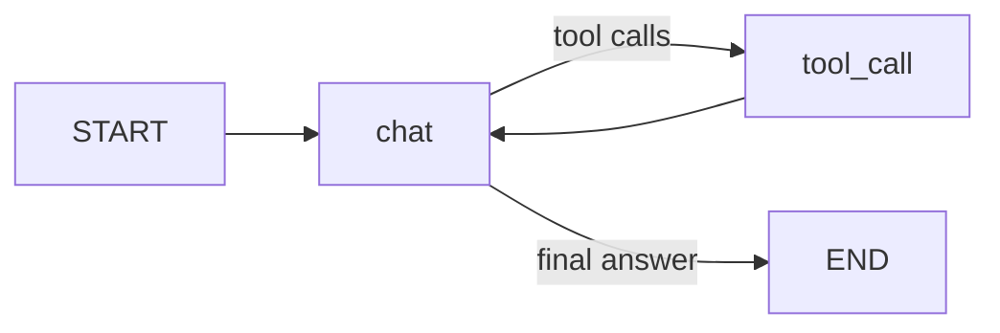
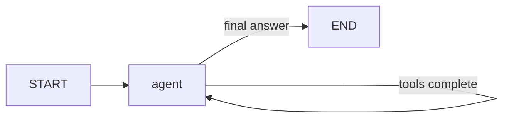

# Agent-mode workflow design

## Objective

Make the coding helper agentic enough to choose when to use tools and how to
continue after observing tool results, while keeping the execution surface
small and bounded. The graph should not encode a fixed sequence of specialist
agents or force a redirection for every request.

## Current workflow

The existing graph is already a basic ReAct loop:

Its limitation is structural: reasoning and tool execution are represented as
two graph nodes. That makes the graph look like a predefined workflow even
though the model is making the tool decision.

## New workflow

The graph now exposes one agent node with a self-loop:

The `agent` node owns the decision loop:

1. If the last message is an assistant tool-call message, execute the requested
   tools concurrently and append their results.
2. Otherwise, call the LLM with the current conversation and context.
3. If the LLM requests tools, checkpoint that assistant message and re-enter
   `agent`; otherwise finish the graph.

This is one graph node, but it deliberately keeps a checkpoint boundary between
the model decision and tool execution. That boundary is required for the
`ask_human` interrupt to resume with the pending tool call instead of rerunning
the model decision from scratch.

## Confinement and guardrails

- `AGENT_MAX_STEPS` bounds the self-loop through LangGraph's
  `recursion_limit`; the default is eight agent rounds.
- Tool calls are restricted to the existing bound tool registry. Unknown tool
  names fail closed with an explicit error.
- Multiple independent tool calls remain concurrent.
- Inbound DLP/intent checks and outbound response checks remain separate
  guardrail components. They are not hidden inside the agent's reasoning loop,
  so policy enforcement remains independently testable and auditable.
- The checkpointer remains unchanged, preserving session history and human
  interrupt resume behavior.

## Why this is agentic

The model chooses whether to use a tool, which available tool to use, the tool
arguments, and whether another reasoning step is needed after observing the
result. The graph only supplies the safe execution boundary and termination
bound; it does not prescribe a chain of specialist agents.

## Operational notes

`AGENT_MAX_STEPS` can be overridden through the environment. Since a tool round
uses a model step and a tool-execution step, the runtime recursion limit is set
to `2 * AGENT_MAX_STEPS + 1`. If the limit is reached, the request fails rather
than allowing an unbounded loop.

Recommended follow-up checks:

- Test a final answer with no tool call.
- Test one tool call followed by a final answer.
- Test multiple concurrent tool calls.
- Test `ask_human` interruption and resume.
- Test a model that repeatedly requests tools and verify the configured limit.
